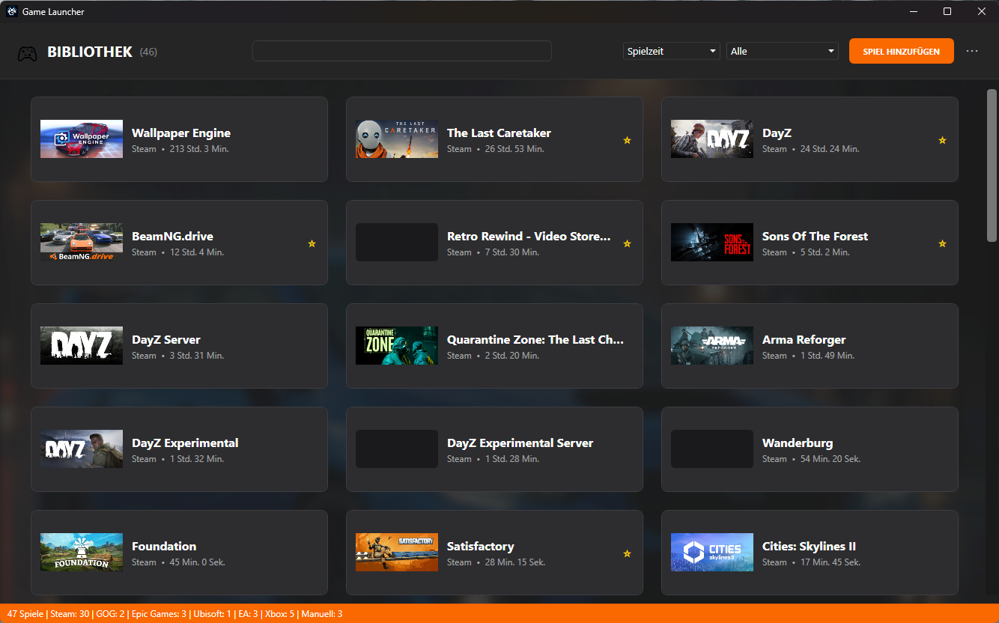

# Game Launcher for Windows

[](https://github.com/Airwolf995/GameLauncher/releases/latest)
[](./LICENSE)


**Alle Spiele an einem Ort – ohne Konto, ohne Cloud.**

Game Launcher führt deine Spiele aus Steam, Epic, GOG, Xbox / Game Pass, EA, Ubisoft und Battle.net in einer gemeinsamen Bibliothek zusammen. Er ergänzt Titelbilder und Beschreibungen, erfasst deine Spielzeit und zeigt beim Spielen auf Wunsch ein Overlay mit Hardwarewerten.

Der Launcher ist eine schnelle, native Windows-Anwendung. Bibliothek, Einstellungen, Spielzeiten und eigene Anpassungen bleiben auf deinem Rechner – es gibt weder ein Benutzerkonto noch eine Cloud-Anbindung.



---

## Funktionen

### 🎮 Eine Bibliothek für alles
- **Automatische Erkennung** installierter Spiele aus **Steam, Epic Games, GOG, Xbox / Game Pass, EA App, Ubisoft Connect und Battle.net**. Battle.net-Spiele öffnen ihre Seite im Battle.net-Client; gestartet wird dort mit „Spielen“, weil Battle.net keinen offiziellen Direktstart anbietet.
- **Nicht-Steam-Spiele**, die du in Steam eingetragen hast, erscheinen ebenfalls.
- **Import** weiterer Spiele aus Verknüpfungen im Startmenü und auf dem Desktop.
- **Eigene Einträge** für Programme und Start-Links wie `steam://`, per Dateiauswahl oder Hineinziehen – nachträglich jederzeit **bearbeitbar**, ohne dass Spielzeit oder Favoriten verloren gehen.

### 🗂️ Ordnen und finden
- **Suche**, **Filter** nach Plattform, Favoriten und Schlagwörtern sowie **Sortierung** nach Name, Favoriten, zuletzt gespielt oder Spielzeit.
- **Favoriten**, **eigene Schlagwörter** und **ausgeblendete Spiele** für große Sammlungen.
- **Karten- oder Listenansicht** in drei Größen.

### 🖼️ Titelbilder und Details
- Titelbilder aus dem lokalen Steam-Zwischenspeicher, sonst automatisch nachgeladen und lokal zwischengespeichert.
- **Cover-Suche** mit Vorschau über die Steam-Suche, mit eigenem API-Schlüssel zusätzlich über [SteamGridDB](https://www.steamgriddb.com/).
- **Detailansicht** mit Beschreibung, Entwickler, Publisher, Erscheinungsdatum und Genres.

### ⏱️ Spielzeit
- Erfasst die **Spielzeit automatisch** anhand der laufenden Prozesse – egal, ob du das Spiel über den Launcher oder anderswo startest.
- Zeigt die **Gesamtspielzeit** direkt auf der Karte, den Zeitpunkt der letzten Sitzung in der Detailansicht.
- Programme, die fälschlich als Spiel zählen würden, lassen sich **ausschließen**.

### 📊 Overlay
- Per **Tastenkürzel** (Standard: `Alt` + `G`) einblendbar, auch während des Spielens.
- Zeigt **CPU** und **GPU** mit Temperatur und Auslastung, **RAM** und **VRAM** mit Belegung, dazu Uhrzeit, laufendes Spiel und **Sitzungsdauer**.

### ⚙️ Komfort
- **Deutsch und Englisch**, neun **Farbdesigns**, eigenes Hintergrundbild und einstellbare Schriftgröße.
- **Autostart**, Minimieren in den **Infobereich** und wahlweise Minimieren oder Schließen beim Spielstart.
- **Sicherung**: Spielzeiten, Favoriten, Schlagwörter und eigene Einträge in eine Datei sichern und auf demselben oder einem anderen Rechner wieder einspielen.
- **Update-Prüfung** mit Kontrolle der Prüfsumme vor der Installation.
- **Einrichtungsassistent** beim ersten Start, der die Spielbibliotheken selbst sucht.

---

## Installation

1. Die **[.NET 8 Desktop Runtime](https://dotnet.microsoft.com/download/dotnet/8.0)** installieren, falls noch nicht vorhanden. Der Launcher bringt sie nicht selbst mit und startet ohne sie nicht.
2. Den Installer `GameLauncher_Setup_<Version>.exe` aus dem **[neuesten Release](https://github.com/Airwolf995/GameLauncher/releases/latest)** herunterladen und ausführen.
3. Beim ersten Start führt der Einrichtungsassistent durch Sprache, Spielbibliotheken und Aussehen.

Neue Versionen meldet der Launcher selbst und installiert sie auf Wunsch.

### Temperaturen im Overlay

Windows gibt die Temperaturen von Prozessor und Grafikkarte nicht an gewöhnliche Programme heraus. Der Launcher liest sie deshalb aus **[LibreHardwareMonitor](https://github.com/LibreHardwareMonitor/LibreHardwareMonitor/releases/tag/v0.9.6)** (geprüft mit Version 0.9.6):

1. LibreHardwareMonitor **als Administrator** starten.
2. Unter **Options → Remote Web Server → Run** den Webserver einschalten (Port `8085`).

Ob die Verbindung steht, zeigen die Einstellungen unter **Overlay → Sensorwerte**. Auslastung und Speicher funktionieren auch ohne LibreHardwareMonitor, ebenso die GPU-Temperatur bei NVIDIA-Grafikkarten.

---

## Datenschutz

Der Launcher speichert alles lokal unter `Dokumente\GameLauncher`. Verbindungen nach außen gibt es nur für die Update-Prüfung (GitHub), für Titelbilder, Spieldetails und die Cover-Suche (Steam) sowie – nur mit eigenem Schlüssel – für die Cover-Suche über SteamGridDB. Einzelheiten stehen in der [Datenschutzerklärung](./PRIVACY.md).

---

## Entwicklung

Voraussetzungen: Windows 10/11 und das **.NET 8 SDK** (festgelegt in [`global.json`](./global.json)).

```powershell
dotnet build .\GameLauncher.csproj -c Debug
dotnet test .\GameLauncher.Tests\GameLauncher.Tests.csproj
```

Hinweise zu Aufbau, Konventionen und Arbeitsablauf stehen in [CONTRIBUTING.md](./CONTRIBUTING.md) und [AGENTS.md](./AGENTS.md).

### Release bauen

```powershell
.\build-release.ps1
```

Das Skript erzeugt einen sauberen Publish in `publish\win-x64` und legt Lizenz-, Copyright-, Drittanbieter- und Datenschutzdateien dazu. Anschließend baut [Inno Setup](https://jrsoftware.org/isinfo.php) mit [`installer.iss`](./installer.iss) daraus den Installer in `installer_output`; Version und Dateien liest das Skript aus dem Publish-Ordner.

---

## Weitere Dokumente

- [Datenschutz](./PRIVACY.md)
- [Mitarbeit](./CONTRIBUTING.md)
- [Sicherheit](./SECURITY.md)
- [Drittanbieter-Hinweise](./THIRD-PARTY-NOTICES.txt)

## Lizenz

Game Launcher ist freie Software unter der [GNU General Public License, Version 3](./LICENSE). Die projektspezifischen Copyright- und Lizenzhinweise stehen in der [COPYRIGHT.txt](./COPYRIGHT.txt).
